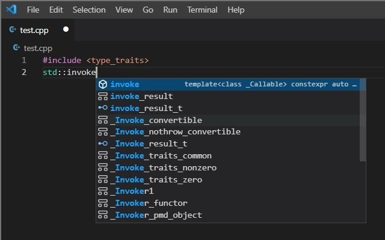
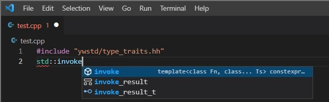
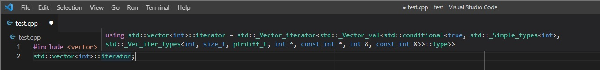
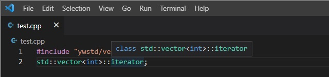

YwStandard(YwStd, Ywstd, ywstd) is a dummy of C++ Standard Library.<br>
It is designed to enable comfortable coding with no compiler required.

## Installation

Copy this repository into your include directory.

## Usage

1. Include ywstd headers instead of the Standard headers.

```C++
// Standard
#include <string>
#include <iostream>
int main() {
  std::cout << "Hello World."s << std::endl;
}

// Ywstd
#include "ywstd/string.hh"
#include "ywstd/iostream.hh"
int main() {
  std::cout << "Hello World."s << std::endl;
}
```

2. Define `_ywstd_` macro at compiling.<br>
   Then, ywstd headers are replaced with compiler-specific ones.

```C++
// ywstd/any.hh

/* comments & pragma once */

#ifdef _ywstd_
#include <any>
#else

/* ywstd definitions */

#endif
```

## How it works

1. Hiding explanation-only definitions in std::_ namesapce.<br>
   It makes the autocomplete list clear.

  + MSVC<br>
    

  + Ywstd<br>
    

2. Showing the information of definitions more simply.

  + MSVC<br>
    

  + Ywstd<br>
    

## License

Copyright 2022 Yw Nineflod @ Ywx9

Licensed under the Apache License, Version 2.0 (the "License");
you may not use this file except in compliance with the License.
You may obtain a copy of the License at

http://www.apache.org/licenses/LICENSE-2.0

Unless required by applicable law or agreed to in writing, software
distributed under the License is distributed on an "AS IS" BASIS,
WITHOUT WARRANTIES OR CONDITIONS OF ANY KIND, either express or implied.
See the License for the specific language governing permissions and
limitations under the License.

# Thank you🙋
